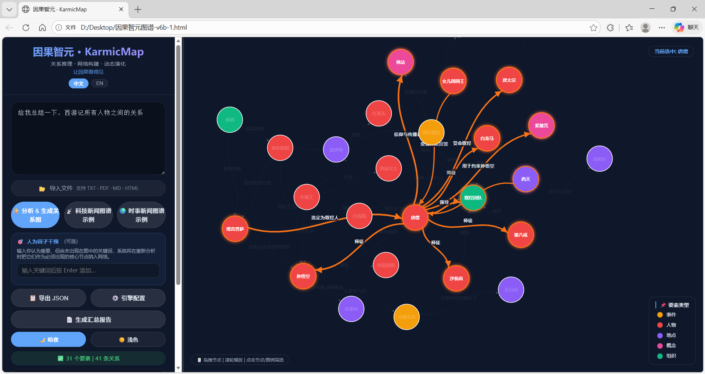
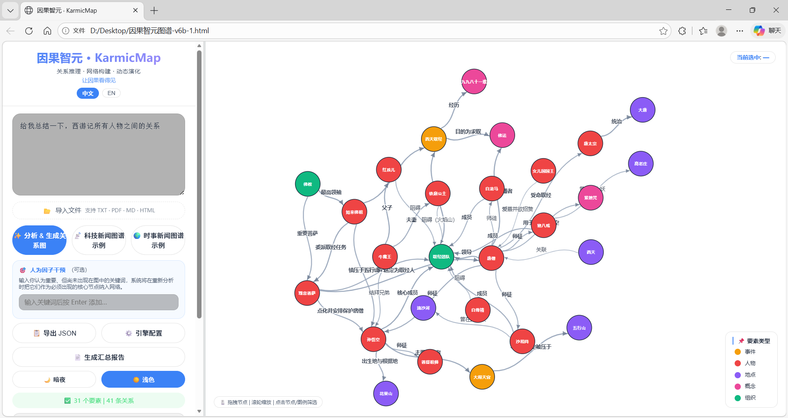
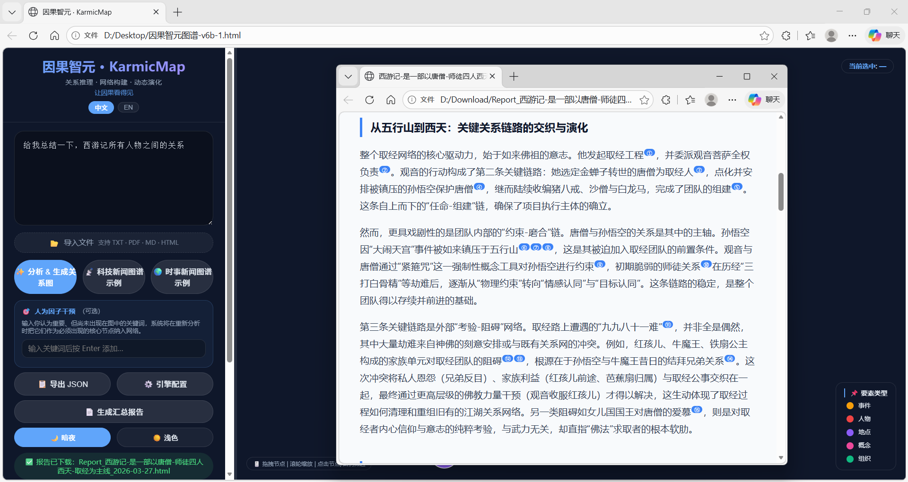
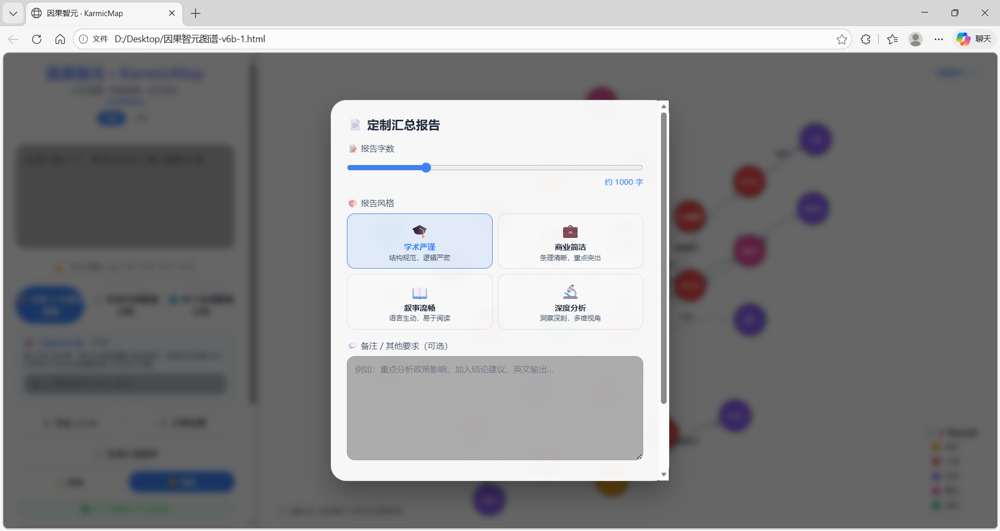
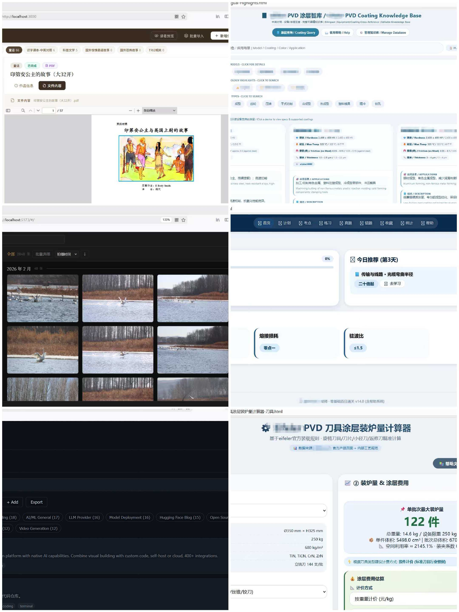

# 因果智元 · KarmicMap

**Making Causality Visible · 让因果看得见**

**Paste any text. Get an interactive causal graph. Zero install.**

[🚀 Live Demo](https://ThomasShen2023.github.io/karmicmap) ·
[⬇️ Download](../../releases/latest) ·
[📖 中文说明](#-中文说明) ·
[💼 Commercial License](COMMERCIAL_LICENSE.md)

---

## What It Does

Paste any text — a news article, a research abstract, a historical account,
or even **a single sentence** — and KarmicMap builds an interactive
relationship network showing who influences what, and how strongly.

> *"总结一下西厢记所有人物之间的关系"*
> *"Explain how different vitamins affect various bodily functions."*
> *"Explique comment les différentes vitamines affectent les diverses fonctions."*
> *"Erkläre, wie verschiedene Vitamine auf verschiedene Körperfunktionen wirken."*

One sentence is enough. The graph appears in seconds.

---

## Features

- 🧠 **Any LLM** — DeepSeek, Kimi, GPT-4o, Ollama, LM Studio, or any OpenAI-compatible endpoint
- 💬 **One sentence → full graph** — no long documents required
- 🎯 **Manual factor override** — inject keywords the AI missed, force them into the network as required nodes
- 🌐 **Bilingual UI** — Chinese / English, auto-detected from browser language
- 📄 **Report export** — download a complete HTML analysis report
- 📂 **File import** — TXT, PDF, MD, HTML · drag & drop supported
- 🌙 **Dual theme** — Dark / Light
- 📋 **Activity log** — API call tracking and usage statistics
- 💾 **Zero dependency** — no npm, no server, no database, no cloud

---

## Screenshots

---

## Device Compatibility

Works on any device with a modern browser.

| Device | Experience |
|---|---|
| 💻 Desktop / Laptop | ✅ Full experience — recommended |
| 📱 Tablet | ✅ Works well, touch supported |
| 📱 Phone | ⚠️ Functional, small screen limits graph clarity |

**How to use:** Download the HTML file → open in browser → configure API → start analyzing.
No app store. No account. No cloud.

---

## Quick Start

**1.** Download `KarmicMap.html` from [Releases](../../releases/latest)
or try the [Live Demo](https://ThomasShen2023.github.io/karmicmap)

**2.** Open in any modern browser

**3.** Click **⚙️ Engine Config** and enter your LLM API details

**4.** Type or paste any text → click **✨ Analyze**

**Recommended APIs:**

| Service | Region | Notes |
|---|---|---|
| [DeepSeek](https://platform.deepseek.com) | Global | Low cost, strong multilingual |
| [Kimi 月之暗面](https://platform.moonshot.cn) | China | Good Chinese support |
| [Tongyi 通义千问](https://dashscope.console.aliyun.com) | China | Alibaba Cloud |
| [OpenAI](https://platform.openai.com) | Global | GPT-4o |
| [Ollama](https://ollama.ai) | Local | Fully offline |
| [LM Studio](https://lmstudio.ai) | Local | Fully offline |

---

## The Story

| | |
|---|---|
| 👤 **Author** | ThomasShen2026 |
| 🎂 **Age** | 53 |
| 💼 **Background** | Non-technical industry |
| 💻 **Machine** | Lenovo Yoga X13 · 2020 |
| ⏱️ **Build time** | 36 hours · v0 → v6c |
| 💰 **Total API cost** | ¥1.97 · ~$0.28 |
| 🛠️ **Method** | Vibe coding — intent-driven, AI-assisted |

No CS degree. No development team. No prior coding experience.

This is not a story about code.
It's a story about what becomes possible when the barrier to building is gone.

---

## One Week · Six Tools

KarmicMap is one of six tools built in the same week, the same way.

| Tool | Type | Description |
|---|---|---|
| **KarmicMap · 因果智元** | Single HTML | AI causal graph tool — *this project* |
| **AI Toolkit Hub** | Full-stack | Auto-aggregates AI tools & news, explained for non-technical users |
| **光迹·叠影 · Lumina Trace** | Full-stack | Local photography archive — monitors folders, never touches source files |
| **译迹 Archive** | Full-stack | Personal document manager — index, classify, preview, zero modification to originals |
| **PVD Coating Knowledge Base** | Single HTML | Bilingual industrial coating knowledge base |
| **PVD Batch Calculator** | Single HTML | Precision batch-load calculator for industrial PVD coating equipment |

All built locally. All privacy-first. All in one week.

---

## License & Copyright

© 2025 ThomasShen2026. All rights reserved.

Licensed under [AGPL-3.0](LICENSE).
Free for personal and non-commercial use.
**Commercial use requires written authorization:** pronghorn05@gmail.com

See [COMMERCIAL_LICENSE.md](COMMERCIAL_LICENSE.md) for details.

---

---

## 📖 中文说明

### 这是什么

把任何文字粘贴进去——一句话也行——AI 提取核心要素，画出"谁影响了谁"的交互式关系网络图。

**支持一句话生成图谱，例如：**
> *"总结一下西厢记所有人物之间的关系"*
> *"梳理一下太平天国运动的主要事件和人物"*
> *"解释一下光合作用的各个环节和影响因素"*

下载 HTML 文件，浏览器打开，配置大模型 API，即可使用。
手机、平板、电脑均可运行。**建议在电脑或平板上使用**，屏幕过小会影响图谱的视觉交互效果。

### 主要功能

- 任意大模型接口（DeepSeek、Kimi、通义、GPT-4o、Ollama 本地部署等）
- 一句话即可生成完整图谱
- 人为因子干预：手动注入 AI 遗漏的关键词，强制纳入图谱节点
- 中英文界面自动切换（跟随浏览器语言），支持手动切换
- 生成可下载的 HTML 分析报告
- 支持 TXT、PDF、MD、HTML 文件导入，支持拖拽
- 暗夜 / 浅色双主题
- 运行日志与 API 用量统计
- 零依赖：无需安装，无服务器，无数据库，无需任何云账号

### 使用方式

1. 从 [Releases](../../releases/latest) 下载 `KarmicMap.html`
   或直接打开[在线演示](https://ThomasShen2023.github.io/karmicmap)
2. 用浏览器打开
3. 点击「⚙️ 引擎配置」填写 API 信息
4. 输入文字，点击「✨ 分析 & 生成关系图」

推荐使用 [DeepSeek API](https://platform.deepseek.com)（国内可用，费用极低，中文效果好）。
完全离线使用可选 [Ollama](https://ollama.ai) 本地部署。

### 这个项目的来历

> 53岁，非技术行业，不懂写代码
> 用一台 2020 年的联想 Yoga X13
> 花了 36 小时，从想法到第 7 个版本
> API 费用合计 **1.97 元人民币**

全程 vibe coding——用自然语言描述需求，AI 协助实现，测试，打破，修复，迭代。
没有计算机背景。没有开发团队。没有任何投资。

这不是一个关于代码的故事。
是一个关于"门槛消失之后，什么变得可能"的故事。

### 同期开发的其他工具

同一周内，用相同方式开发了另外 5 个工具（见上方截图）：

| 工具 | 类型 | 简介 |
|---|---|---|
| **AI Toolkit Hub** | 前后端部署 | 自动聚合全网最新 AI 工具和资讯，为非技术用户提供通俗易懂的知识库 |
| **光迹·叠影** | 前后端部署 | 纯本地摄影作品管理系统，监听指定文件夹，不上云，不动源文件 |
| **译迹 Archive** | 前后端部署 | 个人文档管理系统，支持导入、分类、预览、编辑简介，不对源文件做任何操作 |
| **PVD 涂层知识库** | 单文件 HTML | 工业 PVD 涂层中英双语专业知识库 |
| **PVD 装炉量计算器** | 单文件 HTML | 工业 PVD 涂层设备精确装炉量计算工具 |

### 版权与授权

© 2025 ThomasShen2026 · 保留所有权利

基于 [AGPL-3.0](LICENSE) 开源，个人非商业使用免费。
**商业用途需授权：** pronghorn05@gmail.com

---

*KarmicMap · 因果智元 · v6c · ~105KB · Single file · Zero install*
*© 2025 ThomasShen2026 · AGPL-3.0*

